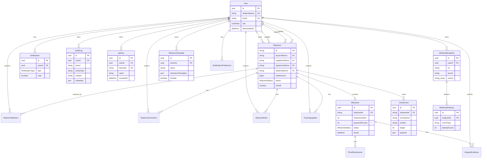

# ChainSettle Database Schema

Human-readable reference for the PostgreSQL data model. **Source of truth:** [`prisma/schema.prisma`](../prisma/schema.prisma).

---

## Entity Relationship Diagram



---

## Table Reference

### `users` (User)

Platform identity keyed by Stellar public address. Roles: `BUYER`, `SUPPLIER`, `LOGISTICS`, `ARBITER`, `ADMIN`. Soft-deactivation via `deactivatedAt`.

**Key relationships:** Participates in shipments by address; owns notifications, API keys, webhooks, templates, audit logs, watchers.

---

### `shipments` (Shipment)

Off-chain mirror of an on-chain escrow shipment. `id` matches the Soroban shipment ID. Amounts are in stroops (`BigInt`).

**Key relationships:** Four participant FKs → `users.stellarAddress`; has many milestones, chain events, comments, notes, tracking updates, watchers.

---

### `milestones` (Milestone)

Payment tranche within a shipment. Unique on `(shipmentId, milestoneIndex)`. Tracks proof, confirmation, deadlines, and dispute escalation.

**Key relationships:** Belongs to shipment; has proof submissions and dispute evidence.

---

### `chain_events` (ChainEvent)

Persisted on-chain events from the Stellar poller. Deduped by `(txHash, eventName)`.

**Key relationships:** Optional FK to shipment.

---

### `notifications` (Notification)

In-app notification for a user (shipment lifecycle, disputes, comments, etc.).

**Key relationships:** Belongs to user.

---

### `webhook_endpoints` / `webhook_deliveries` (WebhookEndpoint / WebhookDelivery)

User-configured HTTP callbacks. Endpoint stores a hashed signing secret and subscribed event types; deliveries track retries.

**Key relationships:** Endpoint → user; delivery → endpoint.

---

### `shipment_templates` (ShipmentTemplate)

Reusable shipment blueprints (participants + milestone template JSON). Can be private or public.

**Key relationships:** Owned by user.

---

### `api_keys` (ApiKey)

Machine credentials. Only the SHA-256 `keyHash` is stored; plaintext is shown once at creation.

**Key relationships:** Owned by user; soft-revoked via `revokedAt`.

---

### `audit_logs` (AuditLog)

Insert-only audit trail for mutations and sensitive admin actions (including impersonation). Links to the acting user via `userId` / `actorId`.

**Key relationships:** Belongs to user (actor).

---

### Supporting tables

| Table | Purpose |
|-------|---------|
| `proof_submissions` | History of IPFS proof uploads per milestone |
| `dispute_evidence` | Buyer/supplier evidence on disputed milestones |
| `shipment_comments` | Participant discussion threads |
| `shipment_notes` | Admin-only internal notes |
| `tracking_updates` | Logistics location/status updates |
| `shipment_watchers` | Users following a shipment |
| `notification_preferences` | Per-user in-app/email preference JSON |
| `event_cursors` | Stellar poller ledger cursor |
| `failed_events` | Dead-letter queue for event processing |
| `reconciliation_runs` | On-chain vs DB reconciliation job results |
| `app_config` | Runtime key/value config (e.g. IPFS limits) |

---

## Migration Workflow

| Command | When to use |
|---------|-------------|
| `npx prisma migrate dev --name <desc>` | **Local development.** Creates a migration from schema diffs, applies it, regenerates the client. |
| `npx prisma migrate deploy` | **CI / staging / production.** Applies already-committed migrations only — never creates new ones. |
| `npx prisma generate` | Regenerates `@prisma/client` after pulling schema/migration changes (no DB write). |
| `npx prisma migrate status` | Shows which migrations are pending. |

**Contributor rules:**

1. Edit `prisma/schema.prisma`, then run `migrate dev` locally.
2. Commit both the schema change and the new folder under `prisma/migrations/`.
3. Never run `migrate dev` against production; use `migrate deploy` there.
4. After schema changes, regenerate the ERD docs (below).

---

## Regenerating the ERD

After changing `prisma/schema.prisma`, update this document:

1. Reflect new/removed models and relations in the Mermaid `erDiagram` above.
2. Add or adjust the matching section under **Table Reference**.
3. Keep the diagram focused on primary entities; supporting tables can stay in the summary table.

Optional tooling (if you prefer auto-generation later):

```bash
# Example: prisma-erd-generator (optional, not required)
# 1. Add generator to schema.prisma
# 2. npx prisma generate
# 3. Copy/adapt output into this file's Mermaid block
```

There is no committed auto-generator today — the Mermaid diagram is **manually maintained** from the Prisma schema so docs stay reviewable in PRs without extra binary deps.
