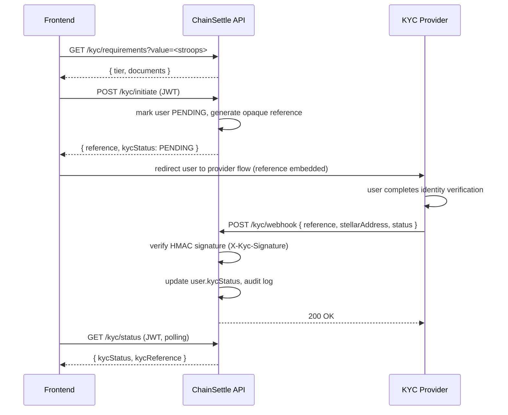

# KYC Integration Guide

ChainSettle gates high-value shipments behind KYC (Know Your Customer) verification. This doc covers the end-to-end flow, the provider webhook payload/signature verification, required environment variables, and how to exercise the flow locally.

Source: [`src/modules/kyc/kyc.controller.ts`](../src/modules/kyc/kyc.controller.ts), [`src/modules/kyc/kyc.service.ts`](../src/modules/kyc/kyc.service.ts).

---

## End-to-end flow



1. **Check requirements** — `GET /kyc/requirements?value=<stroops>` is public and tells the frontend what tier/documents a shipment of a given size will require, before the user commits to anything.
2. **Initiate** — `POST /kyc/initiate` (authenticated) marks the user `PENDING` and issues an opaque `reference` UUID. Only this reference is stored server-side — no identity documents ever pass through ChainSettle's backend.
3. **Provider redirect** — the frontend hands the user off to the third-party KYC provider's own hosted flow (out of scope for this backend), embedding the `reference` so the provider can echo it back later.
4. **Provider webhook** — once the provider reaches a verdict, it calls back `POST /kyc/webhook` with the result. This is the only place identity-verification *results* (not documents) enter the system.
5. **Status polling** — the frontend polls `GET /kyc/status` (authenticated) to learn when `kycStatus` has moved off `PENDING`.

## Endpoints

| Method | Path | Auth | Description |
|---|---|---|---|
| `GET` | `/kyc/requirements?value=<stroops>` | Public | Required tier (`none`\|`basic`\|`enhanced`) and document list for a shipment of this value. |
| `POST` | `/kyc/initiate` | JWT | Begin verification for the authenticated user. Returns `{ reference, kycStatus: PENDING }`. |
| `GET` | `/kyc/status` | JWT | Current `{ kycStatus, kycReference }` for the authenticated user. |
| `POST` | `/kyc/webhook` | Public + HMAC signature | Provider callback that applies a verification result. |
| `DELETE` | `/kyc/:id` | JWT | Withdraw the caller's own still-`PENDING` submission (`id` is the `reference` from `initiate`). 409 if already `VERIFIED`/`REJECTED`. |

## Webhook payload shape

`POST /kyc/webhook`, `Content-Type: application/json`:

```json
{
  "reference": "3fae1e1a-...-a1b2c3",
  "stellarAddress": "GABC...",
  "status": "VERIFIED"
}
```

| Field | Type | Notes |
|---|---|---|
| `reference` | string | The opaque reference returned by `POST /kyc/initiate`. Used to look up the user (falls back to matching on `stellarAddress` if the reference doesn't match). |
| `stellarAddress` | string | The Stellar address of the user this verification belongs to. |
| `status` | `"VERIFIED"` \| `"REJECTED"` \| `"PENDING"` | Maps directly onto the `KycStatus` enum and overwrites the user's current status. |

The matching user is found via `findFirst({ OR: [{ kycReference: reference }, { stellarAddress }] })`, so a webhook still resolves correctly even if the reference was somehow lost, as long as the address matches.

## Signature verification

When `KYC_WEBHOOK_SECRET` is configured, every webhook request must include an `X-Kyc-Signature` header:

```
X-Kyc-Signature: <hex-encoded HMAC-SHA256>
```

The signature is computed as:

```
hex(HMAC_SHA256(KYC_WEBHOOK_SECRET, JSON.stringify(requestBody)))
```

The backend recomputes the same HMAC over the parsed request body and compares it to the header value; a missing or mismatched signature returns `401 Unauthorized` and the status update is **not** applied.

> **Note:** the signature is computed over `JSON.stringify(dto)` — the DTO after class-validator parsing, not the raw request bytes. When integrating a provider, either have it sign the exact JSON body it sends (with keys in the same order: `reference`, `stellarAddress`, `status`) or compute the signature server-side in a small adapter in front of ChainSettle if the provider's own signing scheme differs.

If `KYC_WEBHOOK_SECRET` is unset (empty string), the webhook accepts requests **without** signature verification and logs a warning. This is intended for local development only — always set the secret in any shared or production environment.

## Required environment variables

| Variable | Default | Purpose |
|---|---|---|
| `KYC_WEBHOOK_SECRET` | `''` (disabled) | HMAC secret shared with the KYC provider for webhook signature verification. **Must** be set outside local dev. |
| `KYC_VALUE_THRESHOLD_STROOPS` | `1000000000000` (100,000 USDC @ 7 decimals) | Shipment `totalAmount`, in stroops, at or above which both buyer and supplier must be `VERIFIED` before the shipment can be created. Below this, no KYC is required (`tier: "none"`). |
| `KYC_ENHANCED_VALUE_THRESHOLD_STROOPS` | `10000000000000` (1,000,000 USDC @ 7 decimals) | Shipment value at or above which the `"enhanced"` tier (extra documents: `proof_of_funds`, `enhanced_due_diligence`) is required instead of `"basic"`. |

These live in [`src/config/env.validation.ts`](../src/config/env.validation.ts). `KYC_VALUE_THRESHOLD_STROOPS` and `KYC_ENHANCED_VALUE_THRESHOLD_STROOPS` are the single source of truth for both `getRequirements()` (what the frontend shows) and `meetsThreshold()` (what actually blocks shipment creation in `ShipmentsService.create()`), so they never drift apart.

### Tiers and documents

| Tier | Trigger | Required documents |
|---|---|---|
| `none` | `totalAmount < KYC_VALUE_THRESHOLD_STROOPS` | — |
| `basic` | `KYC_VALUE_THRESHOLD_STROOPS ≤ totalAmount < KYC_ENHANCED_VALUE_THRESHOLD_STROOPS` | `government_id`, `proof_of_address` |
| `enhanced` | `totalAmount ≥ KYC_ENHANCED_VALUE_THRESHOLD_STROOPS` | `government_id`, `proof_of_address`, `proof_of_funds`, `enhanced_due_diligence` |

## Where KYC actually blocks shipment creation

`POST /shipments` calls `KycService.meetsThreshold(totalAmount)`. If the shipment's value meets or exceeds `KYC_VALUE_THRESHOLD_STROOPS`, both the buyer and supplier addresses must have `kycStatus === VERIFIED` (checked via `KycService.isVerified()`), or the request is rejected with `403 Forbidden`. This is enforced in [`ShipmentsService.create()`](../src/modules/shipments/shipments.service.ts) — the `/kyc/requirements` endpoint above only *previews* what will be required; the actual gate lives in shipment creation.

## Configuring a new environment

1. Set `KYC_WEBHOOK_SECRET` to a strong random value, and share it with your KYC provider so it can sign webhook calls.
2. Set `KYC_VALUE_THRESHOLD_STROOPS` / `KYC_ENHANCED_VALUE_THRESHOLD_STROOPS` to the desired thresholds for your deployment (values are in stroops — 1 token unit = 10,000,000 stroops at 7 decimals).
3. Configure your KYC provider's dashboard to call `POST {API_BASE_URL}/api/v1/kyc/webhook` on verification completion, signing the request body with the shared secret as described above.
4. Point your frontend's provider-redirect step at the provider's hosted flow, passing along the `reference` returned from `/kyc/initiate`.

## Testing the flow locally

No provider sandbox is required to exercise the backend side — the webhook is just a plain authenticated-by-signature POST endpoint.

1. Start the API locally (see the root [README](../README.md#4-start-the-development-server)) with `KYC_WEBHOOK_SECRET` set to some test value in your `.env`, e.g. `KYC_WEBHOOK_SECRET=devsecret`.
2. Sign in and call `POST /api/v1/kyc/initiate` to get a `reference`.
3. Compute the HMAC signature for your test payload and call the webhook, e.g. with Node:

   ```js
   const crypto = require('crypto');
   const body = { reference: '<reference-from-step-2>', stellarAddress: 'G...', status: 'VERIFIED' };
   const signature = crypto
     .createHmac('sha256', 'devsecret')
     .update(JSON.stringify(body))
     .digest('hex');
   console.log(signature);
   ```

4. `POST` that same `body` to `/api/v1/kyc/webhook` with header `X-Kyc-Signature: <signature>`.
5. Confirm the update with `GET /api/v1/kyc/status` — `kycStatus` should now be `VERIFIED`.

To exercise the "unsigned/dev mode" path instead, leave `KYC_WEBHOOK_SECRET` unset (or `''`) and call the webhook without the header — it will be accepted with a warning logged.
